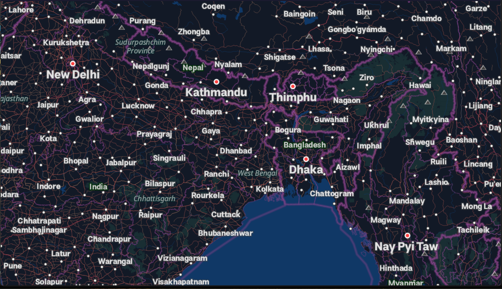
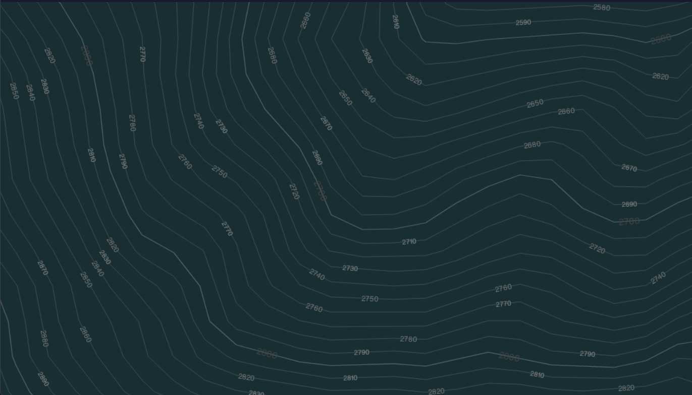
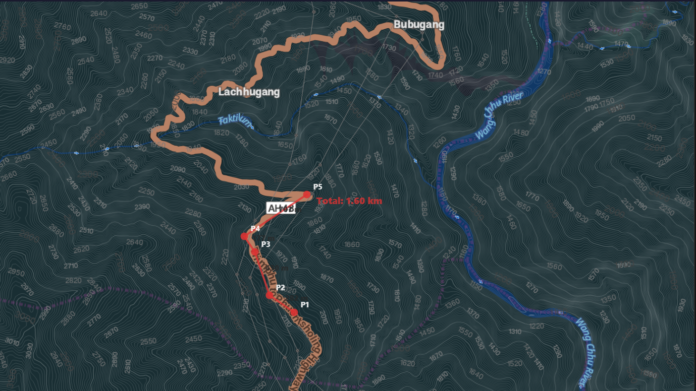

# Routes — Desktop Offline Map Viewer

A lightweight Windows desktop application for viewing offline maps with route planning, navigation controls, and a simple dark interface.

Routes is designed for users who want to view offline map data on a Windows PC without requiring an internet connection while using the map files supported by the application.

## Download

Download the latest release of **Routes** from this repository's **Releases** section.

> **Note:** Routes is currently provided as a Windows `.exe` application packaged together with its required application files and folders.

## Features

- Offline map viewing
- Route planning
- Map navigation and zooming
- Pan and rotate the map
- Distance measurement
- Waypoint support
- Map reset controls
- Dark-map viewing
- Multiple offline map files can be loaded
- No internet connection required for offline map viewing
- No additional software installation required

## System Requirements

- **Windows 10 or later (64-bit)**
- **OpenGL 4.0+ compatible GPU** with updated drivers
- Internet connection is **not required for offline map viewing**
- No additional software installation is required

## Installation

1. Download the latest **Routes.7z** archive from the **Releases** section.
2. Extract the **entire archive** to a folder of your choice.
3. **Do not move, rename, or delete any files or folders from the extracted directory.**
4. Make sure `Routes.exe`, the `_internal` folder, the `obf files` folder, and the other bundled application files remain together.
5. Double-click `Routes.exe` to start Routes.
6. Place your `.obf` map files inside the `obf files` folder.

> **Important:** `Routes.exe` requires the included `_internal` folder and other bundled files to run correctly. Do not move or run `Routes.exe` separately from the extracted application directory.

For the complete installation instructions, use the latest release information in the **Releases** section.

## Map Files

Routes uses offline `.obf` map files.

You can obtain `.obf` map files from:

- [OsmAnd](https://download.osmand.net/list.php)
- OsmAnd-compatible map exports

### How to add map files

1. Download the required `.obf` map files.
2. Open the folder containing `Routes.exe`.
3. Place the `.obf` files inside the `obf files` folder.
4. You can place multiple `.obf` files in the folder.
5. Start `Routes.exe`.
6. Routes will automatically detect the available map files.

> **Important:** Routes does not provide the map data itself. You are responsible for obtaining and using map files in accordance with their applicable terms and licenses.

## How to Use

1. Extract the complete Routes archive.
2. Make sure the `_internal` folder and other bundled files remain in the same directory as `Routes.exe`.
3. Place your `.obf` map files inside the `obf files` folder.
4. Double-click `Routes.exe`.
5. The application automatically loads the available maps from the `obf files` folder.
6. Use the mouse and keyboard controls below to navigate the map.

## Controls

| Action | Control |
|---|---|
| Zoom | Mouse wheel |
| Pan | Left-click and drag |
| Rotate map | Right-click and drag |
| Measure distance | `M` key |
| Add waypoint | `N` key |
| Toggle dark map | `K` key |
| Reset rotation | `R` key |
| Reset map | `X` key |
| Clear distance tool | `Esc` key |
| Clear points | `Delete` key |

## Trial & License

Routes includes a **10-day free trial**.

After the trial period expires, you must purchase a license to continue using Routes.

### License Price

**$5 USD — one-time payment**

The license is intended for use on **one computer** and the generated license key is tied to your machine.

## How to Purchase a License

### 1. Start the Application

Download and run `Routes.exe`.

During the trial period, you can use the application normally.

### 2. Get Your Machine ID

After the trial expires, open the license section in Routes:

**Help → Enter License**

Your application will display your **Machine ID**.

Copy this Machine ID.

### 3. Pay $5 USD / ₹476.66 INR

Choose one of the payment options below:

- **UPI — ₹476.66 INR**
- **PayPal — $5 USD**

### 4. Send Your Machine ID

After completing the payment, provide your **Machine ID** to the developer so that a unique license key can be generated for your computer.

### 5. Receive Your License Key

A license key will be generated for your Machine ID.

### 6. Enter Your License Key

Open:

**Help → Enter License**

Paste the license key into the license field and activate Routes.

> **Important:** Your license key is tied to your machine. If you change computers, a new license may be required.

## Payments & Support

Routes has **separate payment options** for purchasing a license and optionally supporting the developer.

Please use the appropriate option for what you want to do.

---

## Routes License — $5 USD / ₹476.66 INR

This section is for **purchasing a Routes license**.

### Option 1 — UPI QR

For Indian UPI payments, use the fixed-amount QR code below.

**License price: ₹476.66 INR**

Scan the QR code using **Google Pay, PhonePe, Paytm, or another supported UPI application**.

> **Important:** The QR code above is for the **Routes license** and is configured for the fixed amount of **₹476.66 INR**.

### Option 2 — PayPal Payment Link

You can also purchase the **$5 USD Routes license through PayPal**.

**[Pay $5 USD for a Routes License via PayPal](https://www.paypal.com/ncp/payment/4JDGD4D6BV5G8)**

### Option 3 — PayPal QR Code

You can scan the PayPal QR code below to open the **Routes License payment page**.

**License price: $5 USD**

> **Important:** The PayPal payment link and QR code above are for the **Routes license** and the license price is **$5 USD**.

After completing a license payment through **UPI or PayPal**, provide your **Machine ID** to the developer so that a unique license key can be generated for your computer.

---

## Casual Support

This section is for anyone who wants to **optionally support the development of Routes, my software projects, digital artwork, or other projects** without purchasing a Routes license.

### UPI QR

You can also scan the casual-support QR code using **Google Pay, PhonePe, Paytm, or another supported UPI application**.

### PayPal Support

You can also support my work through PayPal.

The PayPal payment page allows you to **choose the amount you would like to contribute**.

**[Support My Work — PayPal](https://www.paypal.com/ncp/payment/G2365LFLKNKSA)**

> **Important:** The UPI and PayPal options in this section are for **optional support only**. They are separate from the **$5 USD / ₹476.66 INR Routes license payment**.

## Screenshots

### Main Map View

### Map Navigation

### Application Interface

## Technical Details

- **Platform:** Windows 10+ (64-bit)
- **Graphics:** OpenGL 4.0+
- **Map engine:** OsmAnd Core
- **UI:** PySide6 (Qt)
- **Map format:** `.obf`
- **Application type:** Windows desktop application
- **Distribution:** Windows executable (`Routes.exe`) with required bundled files

## Privacy

Routes is designed for offline map viewing.

- No account is required to use the application during the trial.
- Offline map viewing does not require an internet connection.
- Map data is loaded locally from the `obf files` folder.
- Routes does not provide or redistribute third-party map data.

## License

This project is distributed as a paid Windows application with a **10-day free trial**.

The application, its executable files, source code (if any), branding, and associated assets remain the property of the developer unless otherwise stated.

You may not redistribute, resell, modify, reverse engineer, or commercially exploit the application without permission from the developer.

Third-party components and map data may have their own licenses and terms.

## Developer

**Mukul Pramanik (SunFlare94)**

Platform: Windows 10+ (64-bit)

GitHub: [SunFlare94](https://github.com/SunFlare94)

DeviantArt: [SunFlare94](https://www.deviantart.com/sunflare94)
